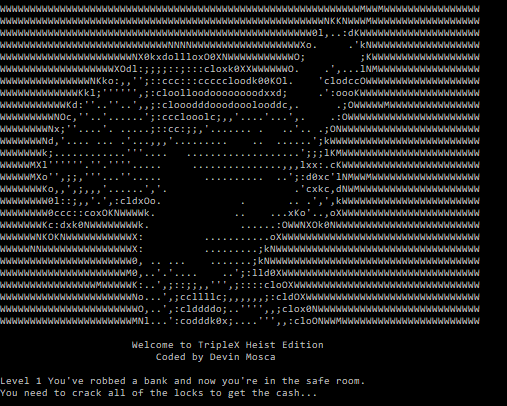

# Triple X Heist Edition

## Description
Welcome to Triple X Heist Edition. I made this as part of a Udemy course to learn the basics of C++ programming. The object of the game is to guess a combination of 3 numbers that fulfil the posted requirements. After completing 5 levels you have beaten the game and sucessfull robbed the bank. 

## Installation

In order to start the application you will need to click the link provided to the games repository. There you will be able to download the file needed to run the game. 

[Repo URL](https://github.com/DMosca2021/dm_triplex_game)

## Usage
To play the game you will:
- Guess 3 numbers that add and multiply to the provided numbers.
- Enter the 3 numbers on the same line with a space in between each number.
- If the answer is correct you will proceed to the next level.
- If incorrect you will then repeat the same level until the correct answers have been submitted.
- There are 5 levels total with each level increasing in difficulty.

## Credits
Credit for this game goes to the Udemy course "Unreal Engine C++ Developer: Learn C++ and Make Video Games" created by Ben Tristem, Sam Pattuzzi, GameDev.tv Team, Rob Brooks.

[Udemy](https://www.udemy.com/)